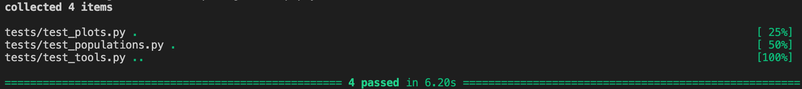
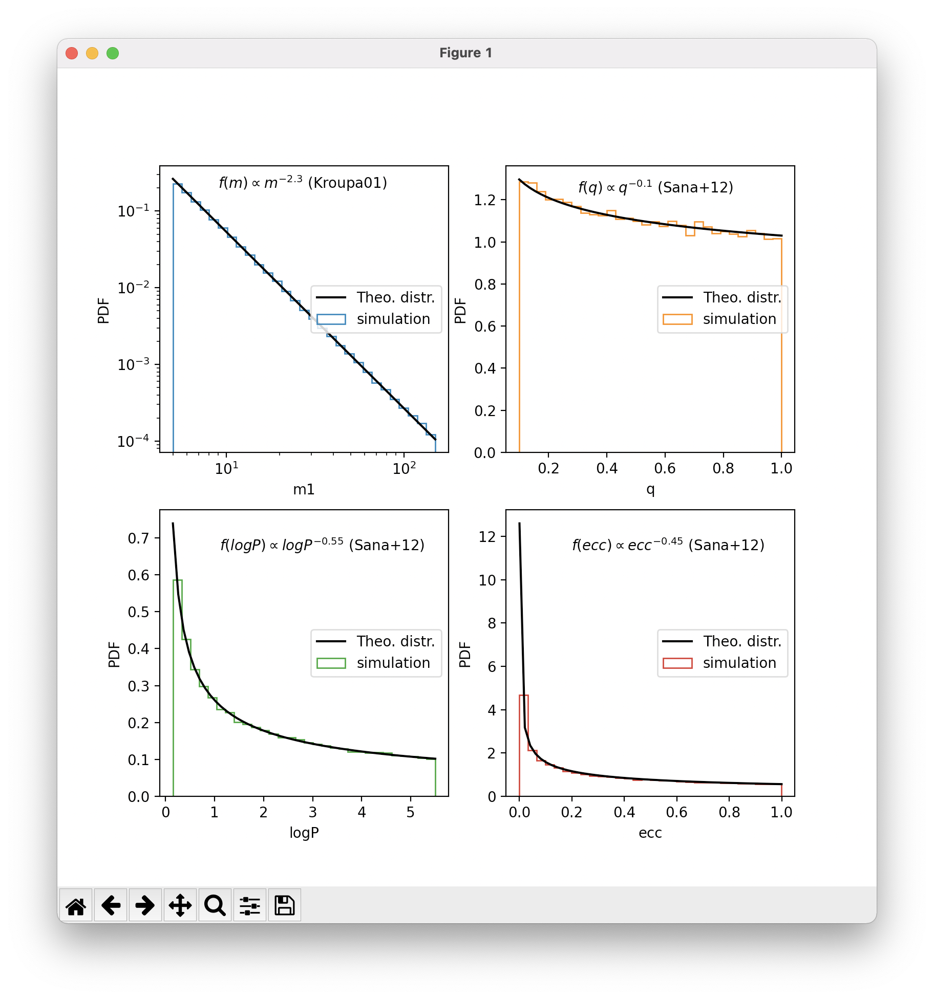
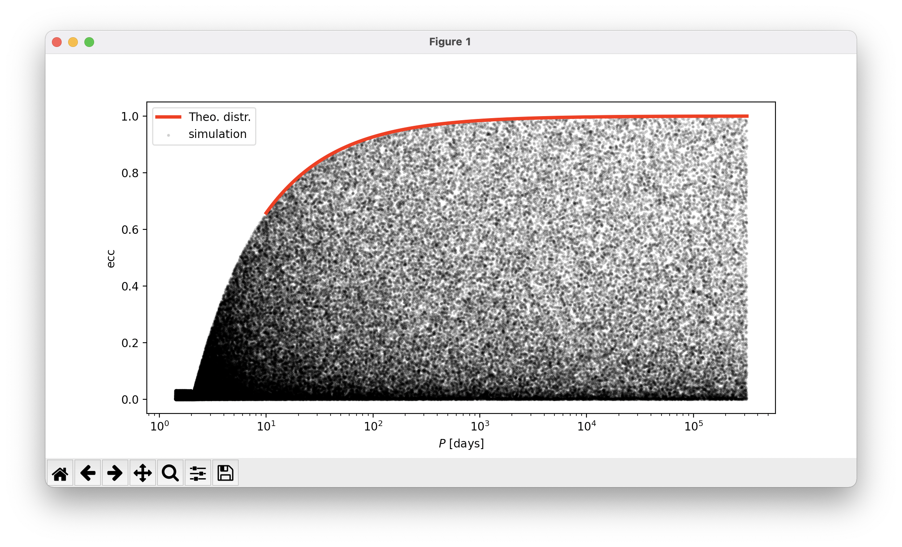

# IC4popsyn
This is a python module that helps you (or at least, that's what I hope) in building initial conditions for population-synthesis simulations (e.g. for [**MOBSE**](https://mobse-webpage.netlify.app/about/) and/or **SEVN**).

## Options
By now I have implemented two models:
1. `sana12`: it's based on [*Sana+12*](https://ui.adsabs.harvard.edu/abs/2012Sci...337..444S/abstract)
2. `sana_eccm&ds`: it's still based on *Sana+12* but the eccentricity are compute following eq. 3 in [M&DS2017](https://iopscience.iop.org/article/10.3847/1538-4365/aa6fb6/pdf).

However, there are many options that allow the user to build it own model. Here are listed the default values of each parameter that can be modified. 
* `alphas` = [-1.3,-2.3]: represents the slope of the broken power-law used as IMF.    
* `mass_range` = [0.1,0.5,150]: identify the mass ranges of the different power-laws (note that *dim(mass_range) = dim(alphas) + 1*).  
* `logP_min` = 0.15: lower limit for the period.  
* `logP_max` = 5.5: upper limit for the period. 
* `logP_slope` = -0.55: exponent of the power-law.  
* `e_min` = 0.0: lower limit for the eccentricity.  
* `e_max` = 0.9999: upper limit for the eccentricity.  
* `e_slope` = -0.45: exponent of the power-law. 
* `q_min` = 0.1: lower limit for the mass ratio.   
* `q_max` = 1.0: upper limit for the mass ratio.  
* `q_slope` = -0.1: exponent of the power-law.  
* `mass_min` = 0.1: minimum mass of the secondary.  

You can change each paramenter passing it to function as input `parameter=value` (see `example.py`).

## Example
The `example.py` script is a simple example of how to use this module. It produces two MOBSE-like input files with the initial conditions based on the two avaible models (I'm working to implement new models 👨‍💻).

## Test
I prepared some tests that can be run with *pytest*. Typing `pytest` on the command line you should obtain something like  

and two `matplotlib` windows. One will show the distributions for the [*sana_12*](img/sana.png) model and the other the eccentricity vs period according to the [*sana_eccM&DS*](img/eccM&DS.png) model.  
  

